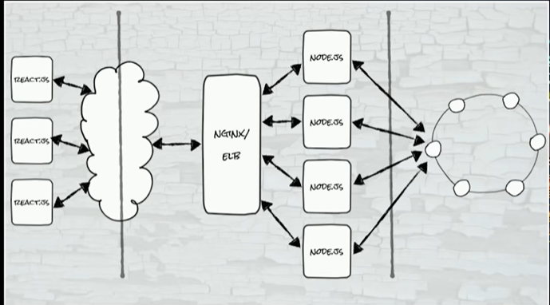
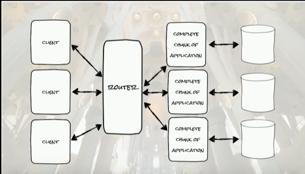
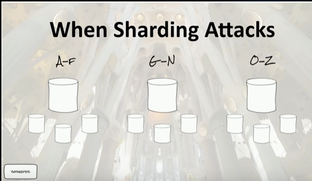
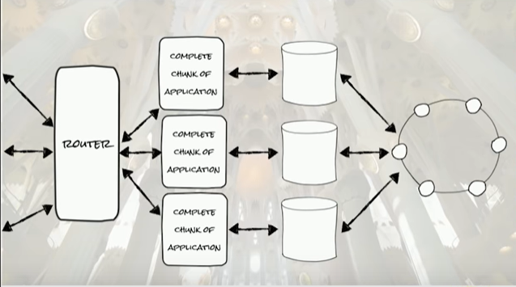
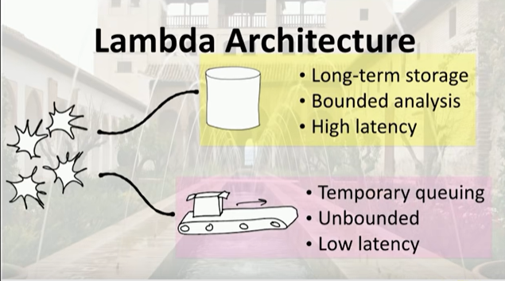
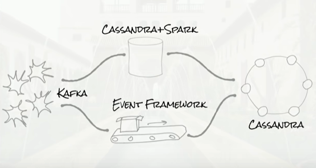

## Four Distributed Systems Architectural Patterns by Tim Berglund

#### LINK:  https://www.youtube.com/watch?v=tpspO9K28PM

### I. Modern Three- Tier Architecture (MVC)
#### Tiers:
1. Presentation Tier (JSP)
2. Business Tier (EJB/servlet)
3. Data Tier (Oracle)

#### Evolved to:
1. Frontend: lots of scaled frontends as ReactJS hosted on a cloud. Load balance like NGINX/ELB
2. Backend: Many NodeJS instance
3.  Data: Casandara instanes

##### CASANDRA:
1. All nodes are same, peer-peer DB with no central node
2. Each node has a token which is used to divide up the data to R/W into DB
3. Problem might be if I scale to many more nodes, then I have to decide where to write the data
4. Replication can be done incase of node failure by writing the write replicas in the next 2 nodes as a walk
5. Now the problem is if the data is mutable and a GARBAGE COLLECTOR PAUSE causes inconsistency between    the three copies? ( https://docs.datastax.com/en/dse-trblshoot/doc/troubleshooting/gcPauses.html)

**STRENGTHS**
1. Rich front-end framework(scale, UX)
2. Hip, scalable middle tier
3. Basically infinitely scalable data tier
    check electrode by walmartlabs on github

**WEAKNESS**
1. State in middle tier should be stateless
2. Delivering low latency response times is a challenge

### II. SHARED Architechture
*  break application into pieces such that each one works as non distributed system
*  router here can be zookeeper
*  slack uses this since it can have shards based on organizations

When Sharding Attack occurs
*  zookeeper helps elect a master.
*  master handles writes and slaves handle reads
* long Garbage collector pause or network switch down can cause partitions and slaves ask zookeeper to elect a master and then this might cause two masters
*  re sharding is also hard

**STRENGTHS**
1.  Client isolation is easy (data and deployment) eg. EURO GDRP data separate from others
2.  Know and simple technologies

**WEAKNESS**
1.  Complexity. eg monitoring and logging across shards
2.  No comprehensive view of data (ETL) because data spread over shards
3.  Oversized shards can cause pressure on hardware.

Solution: aggregate the data into a larger database for ETL, Logging

### III. LAMBDA
*  Not a general purpose arch. more of a day of dealing with analysis. 
*  Streaming (unbounded) vs batch (bounded) data
*  Assumes data is unbounded and immutable
*  One for bounded and one for unbounded

#### KAFKA (distributed mq)
*  divide topics into multiple brokers.
*  producer makes messages and hashes based on account ID/something else
*  Ordering only maintained between partitions but not whole topics
*  we are giving up on ordering since distributed system

**STRENGTHS**
1.  Optimizes subsystems based on operational requirements
2.  Good at unbounded data unlike the ones before
3.  Very very scalable

**WEAKNESS**
1.  Complex to operate and maintain because have to write the code twice

### IV. STREAMING
*  integration is a first-class concern
*  life is dynamic; databases are staic
*  Tables are stream and streams are tables
*  Keep your services close, your computation closer

all data in MQ, data like topics. No data centralized. Streams API for Kafka
Storing data in messages
first-class events